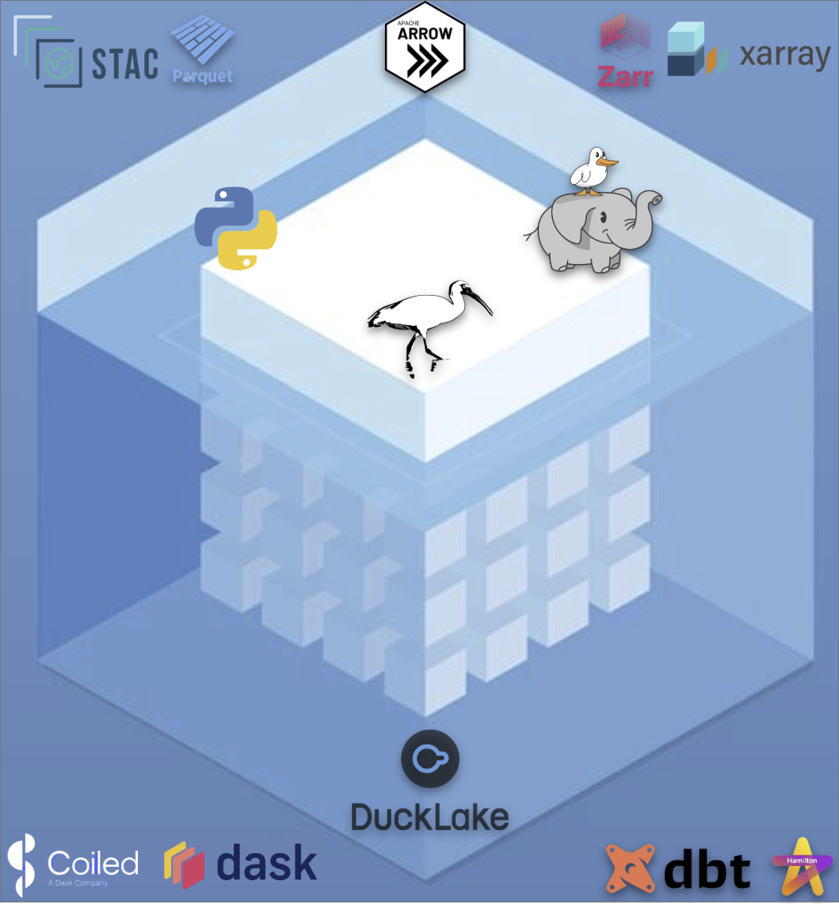

# ice-mELT DuckLake: EO PV Data Pipeline

A modern data lakehouse pipeline for Earth Observation (EO) photovoltaic (PV) segmentation and energy forecasting research, built on open-source technologies and cloud-native architectures.

## 🎯 Project Overview

This project implements a comprehensive data pipeline for processing and analyzing global photovoltaic installation datasets, combining:
- **Vector data**: PV installation polygons and point coordinates from multiple DOI open-access datasets
- **Raster data**: Satellite multispectral imagery and irradiance data via public STAC catalogs
- **Analytical processing**: Spatial indexing, administrative boundary enrichment, and energy forecasting

## 🏗️ Architecture

<div align="center">

</div>

### Project Name Explained

**ice-mELT DuckLake** reflects our modern data architecture approach:

- **Ice**: Leverages **Iceberg** open table format and **Icechunk** tensor storage engine
- **mELT**: **Modern** data stack with **Extract-Load-Transform** pipelines ([dbt methodology](https://www.getdbt.com/blog/extract-load-transform))
- **DuckLake**: Data lakehouse architecture using the new **DuckLake** table format for SQL-based metadata management

### Core Technologies

**Storage & Formats**
- **Local filesystem** and **S3-compatible buckets** for data storage
- **Zarr** data format with **Icechunk** tensor storage engine for rasters
- **VirtualiZarr** for virtual datasets referencing original imagery from STAC assets
- **Parquet/GeoParquet** for lakehouse tables and vector data
- **COG/GeoTIFF** for raster sources

**Data Lakehouse & Catalogs**
- **DuckLake** - Open lakehouse format using SQL databases for metadata management
- **Apache Iceberg** open table format for ACID transactions (complementary to DuckLake)
- **STAC** (SpatioTemporal Asset Catalog) for metadata and asset discovery
- **H3 spatial indexing** for efficient spatial operations

### 🦆 **Why DuckLake? A Key Architectural Decision**

**DuckLake** addresses fundamental limitations in existing lakehouse formats by storing metadata in a transactional SQL database rather than as "many small files" in object storage. This enables single-query metadata access, reliable ACID transactions, and seamless integration with existing SQL tools.

**Key Benefits for EO Research:**
- **Fast metadata access** for spatial workloads
- **Reliable cross-table transactions** for multi-dataset integration
- **Collaborative research** with consistent concurrent access
- **Cost-effective scaling** using free tier PostgreSQL for metadata

*For detailed design philosophy and "Big Data is Dead" perspective, see [modern_data_stack.md](modern_data_stack.md)*

**Query Engines**
- **Transactional**: PostgreSQL with pgstac, pg_mooncake, cloud via Neon/Supabase
- **Analytical**: DuckDB (local) + MotherDuck (cloud scaling)

**Transform & Processing**
- **dbt** for Python + SQL model development, lineage, testing
- **Ibis** Python dataframe API compiling to multiple SQL backends
- **Hamilton DAGs** for ELT dataflow pipelines
- **Xarray** for labeled multi-dimensional arrays
- **Tensorstore** for reading/writing large ND-arrays

**Data Sources**
- DOI datasets via **datahugger**
- STAC assets for satellite imagery
- **Overture Maps** for admin boundaries, building footprints, land cover
- **Google Solar API** and **NREL NSRDB** for irradiance data

## 📊 Current State

### ✅ Completed
- **dlt ingestion pipeline** for PV vector datasets
  - 7 global DOI datasets ingested so far (300K+ PV point-coordinates and >100K polygon installations)
  - Automated download, standardization, and GeoParquet export
  - DuckDB loading with proper schema management
- **dbt project structure** with staging/prepared/curated layers
- **DuckDB + dbt-duckdb integration** with spatial extensions
- **Development environment** with conda, extensions, and testing

### 🔄 In Progress
- dbt Python + SQL models for data transformations
- Spatial processing utilities (H3 indexing, admin boundaries)

## 🗺️ Roadmap

### Phase 1: Core Data Pipeline
- [x] **Implement dlt ingestion**: PV datasets ✅
- [ ] **Implement dlt ingestion**: STAC catalogs and conversion to GeoParquet
- [ ] **Implement initial dbt models**: Python + SQL transformations

### Phase 2: STAC & Raster Integration  
- [ ] **Implement STAC database features** using rustac and pgstac
- [ ] **Configure STAC querying** for rasters using H3 and PV labels
- [ ] **Implement raster retrieval** and processing workflows

### Phase 3: Multi-Backend & Cloud
- [ ] **Refactor code using Ibis** multi-SQL backend dataframe library
- [ ] **Configure R2 object storage** and Iceberg catalog features
- [ ] **Configure Neon serverless PostgreSQL** for transactional workloads
- [ ] **Configure MotherDuck** for cloud analytical scaling

### Phase 4: Advanced Analytics
- [ ] **Implement VirtualiZarr** virtual datasets referencing original GeoTIFF/COG assets
- [ ] **Work out raster retrieval** and processing optimization
- [ ] **Build datacubes** of STAC imagery with PV locations
- [ ] **Develop energy forecasting models**

## 🚀 Getting Started

### Prerequisites
```bash
# Install conda environment
conda env create -f environment.yml
conda activate eo-pv-cv

# Install DuckDB extensions
# Extensions are auto-loaded via dbt configuration
```

### Quick Start
```bash
# 1. Run data ingestion pipeline
python doi_dataset_pipeline.py

# 2. Test dbt connection
dbt debug

# 3. Run dbt transformations
dbt run

# 4. Check data quality
dbt test
```

### Project Structure
```
├── datasets/raw/geoparquet/     # Processed vector data
├── models/                      # dbt transformations
│   ├── staging/                 # Raw data standardization
│   ├── prepared/                # Business logic & spatial processing
│   └── curated/                 # Final analytical datasets
├── utils/                       # Shared utilities
├── doi_dataset_pipeline.py      # Main ingestion pipeline
├── dbt_project.yml             # dbt configuration
└── profiles.yml                # Database connections
```

## 🔧 Configuration

### Free Tier Strategy

Our architecture is designed to maximize free tier usage for research workloads:

**Current Setup (Local Development)**
- **DuckDB**: Local analytical processing (free)
- **Local filesystem**: Development data storage (free)

**Planned Cloud Integration (Research Scale)**
- **Cloudflare R2**: 10GB free storage + free egress
- **MotherDuck**: 10GB free analytical processing
- **Neon PostgreSQL**: 0.5GB free for DuckLake metadata
- **Supabase**: Alternative free PostgreSQL for pgstac

**Cost Projection**: Research workloads should operate entirely within free tiers (~$0/month) or minimal costs (~$5-10/month) for larger datasets.

### Environment Variables
```bash
# Optional: MotherDuck cloud scaling
export MOTHERDUCK_TOKEN="your_token"

# Optional: PostgreSQL connections (free tiers)
export NEON_POSTGRES_URL="postgresql://..."
export SUPABASE_POSTGRES_URL="postgresql://..."

# Optional: Cloudflare R2 object storage
export R2_ACCESS_KEY_ID="your_key"
export R2_SECRET_ACCESS_KEY="your_secret"
export R2_BUCKET_NAME="your_bucket"

# Optional: Google Sheets integration
export GOOGLE_SERVICE_ACCOUNT_JSON="path/to/credentials.json"
```

### Key Files
- **`profiles.yml`**: Database connections (DuckDB, MotherDuck, PostgreSQL)
- **`dbt_project.yml`**: Model configurations and DuckDB optimizations
- **`.dlt/config.toml`**: Data loading pipeline settings

## 📈 Data Products

### Current Datasets
- **Global PV installations**: 10's of thousands of polygons from 7 validated sources
- **Administrative boundaries**: Country/region context via Overture Maps
- **H3 spatial index**: Multi-resolution hexagonal grid for efficient queries

### Planned Products
- **PV-STAC datacubes**: Satellite imagery aligned with PV locations
- **Irradiance time series**: Solar potential analysis
- **Energy forecasting models**: ML-based production estimates
- **Global PV database**: Curated, harmonized installation dataset

## 🤝 Contributing

This is a research project for MS thesis work. The pipeline architecture and methodologies are designed to be reproducible and extensible for similar EO data processing workflows.

## 📄 License

Research project - see institution guidelines for data usage and attribution requirements.

---

<!-- **Built with**: dlt, dbt, DuckDB, Apache Iceberg, STAC, H3, and the modern data stack -->