# Modern Data Stack Philosophy: Beyond the Big Data Myth

*This philosophy guides the ice-mELT DuckLake project: leveraging modern tools to build sophisticated geospatial analysis capabilities without the complexity and cost traditionally associated with "Big Data" infrastructure.*

## The "Big Data is Dead" Perspective

References:
1. [Big Data is Dead](https://motherduck.com/blog/big-data-is-dead/?trk=feed-detail_main-feed-card_feed-article-content)
2. [Who Cares if Big Data Is Dead!](https://www.ml4devs.com/en/articles/who-cares-if-big-data-is-dead/)
3. [“Big Data” Gone Missing](https://medium.com/centric-tech-views/big-data-gone-missing-what-the-heck-happened-to-this-viral-business-trend-f557671b881d)
5. [The Modern Data Stack is a Dumpster Fire](https://medium.com/@tfmv/the-modern-data-stack-is-a-dumpster-fire-b1aa81316d94)

### Historical Context and Reality Check

The era of Big Data hype (2010-2020) promised that massive scale was the solution to all data problems. However, as [Jordan Tigani from MotherDuck demonstrates](https://motherduck.com/blog/big-data-is-dead/), **most organizations don't actually have Big Data**:

- **90% of BigQuery queries** processed less than 100MB of data
- **Median enterprise data warehouse** is under 100GB
- **Most "Big Data" projects** failed due to complexity, not scale limitations

    <figure>
        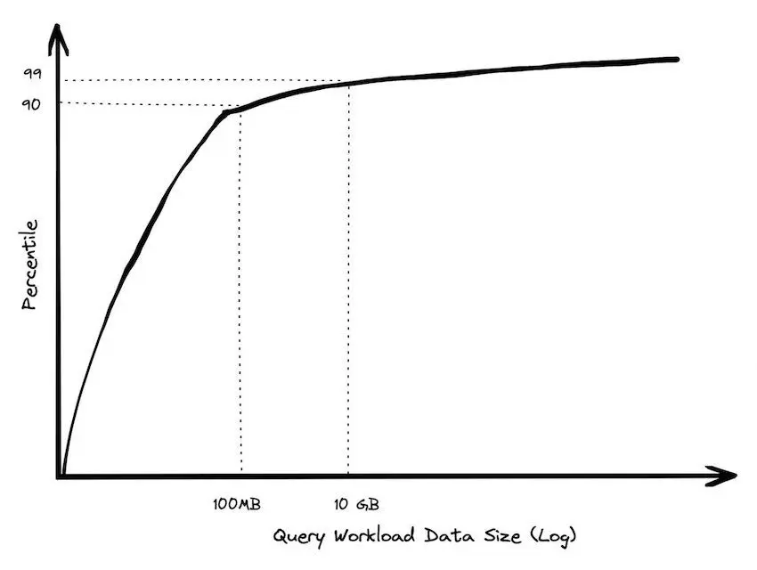
        <figcaption align = "center"> Only 10% of BigQuery queries process more than 100MB of data! </figcaption>
    </figure>

### The Medium Data Reality

Research labs and small-medium companies primarily deal with **"medium data"** - datasets that:
- Fit comfortably on modern single-node systems (e.g. 64+ cores, 256GB+ RAM in a single node)
- Benefit more from smart processing than distributed computing
- Require sophisticated analysis, not just storage and retrieval
- Most data sits stale and unused, not actively queried
  
**Key Insight**: *"Big Data is when the cost of keeping data around is less than the cost of figuring out what to throw away"* - most organizations are data hoarders, not data giants.

    <figure>
        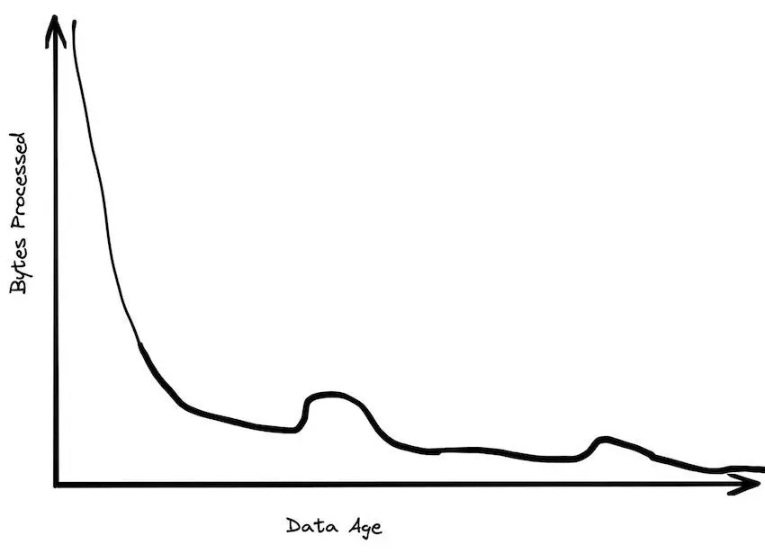
        <figcaption align = "center"> The reality of data usage in most organizations. </figcaption>
    </figure>

## Single-Node Computing Renaissance

### The Receding Big Data Frontier

Modern hardware capabilities have fundamentally shifted what constitutes "Big Data":

**2004 (MapReduce era)**: Single machine = 1 core, 2GB RAM
**2025**: Single machine = 64+ cores, 24TB+ RAM (AWS x1e.xlarge)

**Result**: What required distributed systems in 2004 now runs efficiently on a laptop.

### DuckDB and the Single-Node Advantage

DuckDB exemplifies this shift:
- **Columnar processing** with vectorized execution
- **Parallel query execution** on multi-core systems  
- **Memory-efficient** algorithms for larger-than-RAM datasets
- **Zero administration** - no clusters, no configuration complexity

**Performance Reality**: A single DuckDB instance often outperforms distributed systems for typical *analytical workloads* while being orders of magnitude simpler to operate.

## Cloud Advantages with Scaling-to-Zero

### The "$10/Month Lakehouse" Economics

Following [Tobias Müller's analysis](https://tobilg.com/the-age-of-10-dollar-a-month-lakehouses), modern cloud services enable cost-effective data architectures:

**Free Tier Optimization**:
- **Cloudflare R2**: 10GB storage + free egress
- **MotherDuck**: 10GB analytical processing  
- **Neon PostgreSQL**: 0.5GB for metadata
- **Supabase**: Alternative PostgreSQL option for BaaS

**Scaling-to-Zero Benefits**:
- **Pay only for active compute** (serverless functions, containers)
- **Automatic scaling** based on actual demand
- **No idle infrastructure costs** during research downtime or local development iteration

### Storage Efficiency Through Virtual Datasets

**VirtualiZarr Approach**:
- Reference original satellite imagery assets via STAC catalogs
- Avoid duplicating hundreds of GB of high-fidelity data
- Manage metadata and derived products in minimal storage

**Result**: Process hundreds of GB of imagery while using only a few GB's of actual object storage.

## STAC, Zarr, and Virtual Datasets: The Future of EO Data

References:
1. [What Is Zarr? A Cloud-Native Format for Tensor Data](https://earthmover.io/blog/what-is-zarr)
2. [Is Zarr the new COG?](https://element84.com/software-engineering/is-zarr-the-new-cog/)
3. [Zarr + STAC](https://element84.com/software-engineering/zarr-stac/)
4. [Fundamentals: Tensors vs. Tables](https://earthmover.io/blog/tensors-vs-tables)

### The Cloud-Native Array Revolution

**Zarr as "Parquet for Arrays"**: While Parquet optimizes columnar storage for tabular data, Zarr provides chunked storage for multi-dimensional arrays. Both are designed for analytics and scalable access patterns in cloud environments.

**Why Zarr Matters for EO Research**:
- **Chunked storage** enables selective data loading - only read what you need
- **Cloud-optimized layout** works efficiently with object storage (S3, GCS)
- **Parallel access** supports distributed computing frameworks
- **Self-describing metadata** embedded directly with data

    <figure>
        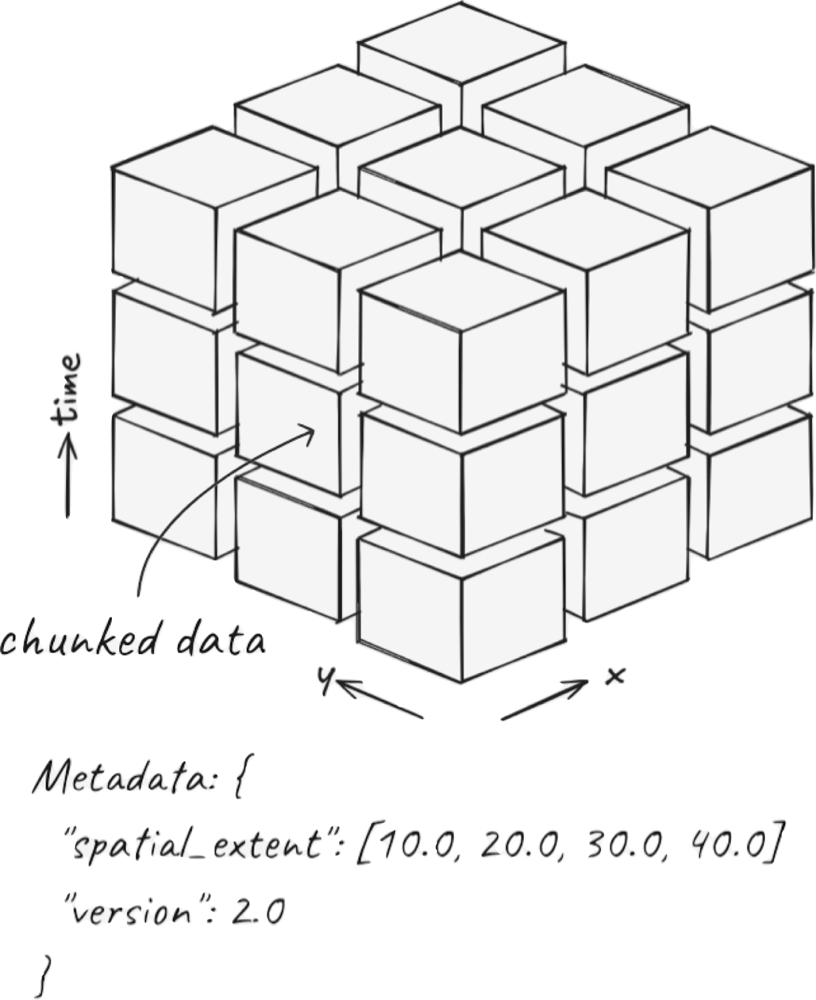
        <figcaption align = "center"> Zarr's chunked storage layout enables efficient access to subsets of large arrays using relevant spatio-temporal indexing. </figcaption>
    </figure>

### The Fundamental Advantage: Arrays vs Tables for Geospatial Data

**The "Flattening Problem"**: Converting multidimensional geospatial data to tabular format creates massive inefficiencies:

> *"Flattening multidimensional data can be thought of 'unrolling' each array into a single column, producing a standard tabular structure. Elements that were near each other in multidimensional space can end up very far apart in flattened space."*

**Coordinate Explosion**: When satellite imagery or climate data is flattened to tables:
- **NetCDF/Zarr approach**: Store coordinates once per dimension (3,481 values for a 5TB weather dataset)
- **Tabular approach**: Duplicate coordinates for every data point (964+ billion values for the same dataset)
- **Performance impact**: 10x+ slower queries due to redundant coordinate scanning

**Why This Matters for PV Research**:
- **Satellite imagery**: Naturally exists as >=3D arrays (lat, lon, time) with spectral bands
- **Spatial analysis**: Neighboring pixels are computationally related, not independent rows
- **Temporal analysis**: Time series at each location should be efficiently accessible
- **Multi-scale processing**: Pyramidal data structures enable zoom-level optimizations

**Array-Native Benefits**:
- **Orthogonal indexing**: O(Nc) complexity vs O(N) for tabular scans
- **Spatial locality**: Nearby pixels stored together for efficient access
- **Dimension-aware operations**: Reductions, aggregations, and transformations respect data structure
- **Memory efficiency**: Load only required spatial/temporal slices

    <figure>
        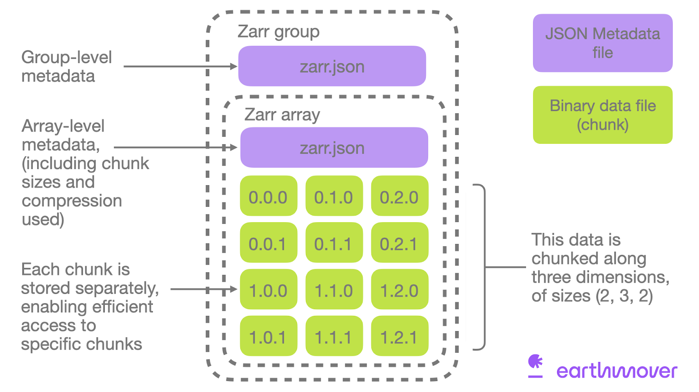
        <figcaption align = "center"> Metadata and raw binary data for a single Zarr store. </figcaption>
    </figure>

### STAC + Zarr: Complementary Technologies

    <figure>
        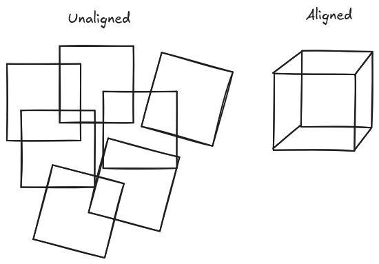
        <figcaption align = "center"> Visual diagram of a collection of aligned (cube) vs unaligned (different extents) geospatial datasets. </figcaption>
    </figure>

**STAC** (SpatioTemporal Asset Catalog) provides **discovery and indexing** for any spatiotemporal data, while **Zarr** provides **efficient storage and access** for multi-dimensional arrays. Together, they solve different but complementary problems:

**STAC Strengths**:
- **Data discovery**: Search across multiple datasets and catalogs
- **Metadata standardization**: Consistent spatiotemporal indexing
- **Federated search**: Find data across distributed catalogs
- **Asset management**: Track relationships between data products

    <figure>
        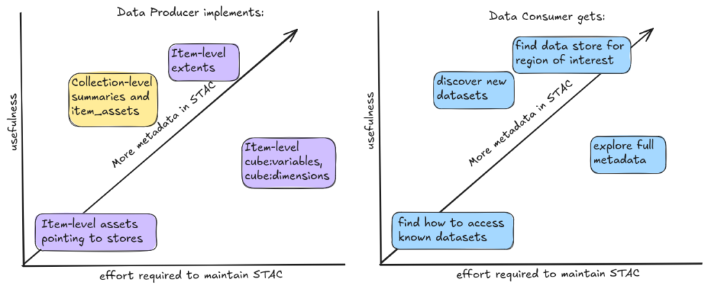
        <figcaption align = "center"> STAC enables discovery and indexing to both original data producers and downstream consumers. </figcaption>
    </figure>

**Zarr Strengths**:
- **Efficient access**: Fast, chunked reads from large arrays
- **Cloud-native**: Designed for object storage and parallel computing
- **Hierarchical organization**: Groups and arrays with rich metadata
- **Compression and filtering**: Optimized storage and transfer

### Virtual Datasets: Maximum Efficiency, Minimum Duplication

**The Problem**: Traditional approaches require copying and converting massive satellite archives, leading to:
- **Storage explosion**: Duplicating terabytes of existing imagery
- **Processing overhead**: Converting between formats
- **Synchronization challenges**: Keeping copies up-to-date

**VirtualiZarr Solution**:
> *"VirtualiZarr offers a Zarr-native way to work with existing data formats like NetCDF or HDF5 by accessing data in those formats via the Zarr store API. This enables efficient access and analysis without converting or duplicating the original files."*

**Practical Benefits for EO Workflows**:
- **Reference existing STAC assets**: Point to original COGs/GeoTIFFs without copying
- **Zarr-compatible access**: Use modern array libraries (xarray, Dask) on legacy formats
- **Minimal storage footprint**: Metadata-only approach for massive datasets
- **Immediate availability**: No waiting for large-scale data conversions

**Full-Circle Integration**: VirtualiZarr enables a complete workflow integration:

1. **pgstac queries** gather relevant STAC items for ROI within H3 hex cells
2. **VirtualiZarr creates** virtual Zarr stores referencing STAC imagery assets
3. **Kerchunk references** can be exported as Parquet files for the virtual stores
4. **DuckLake manages** these Parquet-stored references alongside vector PV data
5. **Result**: Unified SQL interface for both vector labels and raster imagery references

This approach combines the best of all worlds: STAC discovery, Zarr array processing, Parquet efficiency, and DuckLake's SQL-based metadata management - **all without duplicating the underlying satellite imagery**.

References:
1. [Store virtual datasets as Kerchunk Parquet references](https://projectpythia.org/kerchunk-cookbook/notebooks/advanced/Parquet_Reference_Storage.html)
2. [Writing to Kerchunk’s format and reading data via fsspec](https://virtualizarr.readthedocs.io/en/latest/usage.html#writing-to-kerchunk-s-format-and-reading-data-via-fsspec)

### Real-World Implementation Strategy

**Phase 1: STAC Catalog Foundation**
- **Index existing PV datasets** in STAC collections
- **Standardize metadata** across different DOI sources
- **Enable spatial/temporal search** for PV installations

**Phase 2: Virtual Zarr Integration**
- **Create virtual Zarr stores** referencing STAC imagery assets
- **Align PV labels with satellite imagery** using H3 spatial indexing
- **Enable array-based analysis** without data duplication

**Phase 3: Hybrid Data Products**
- **Combine vector PV data** (in DuckLake) with **raster imagery** (via VirtualiZarr)
- **Generate analysis-ready datacubes** for specific regions/timeframes
- **Support both interactive analysis** and **batch processing** workflows

    <figure>
        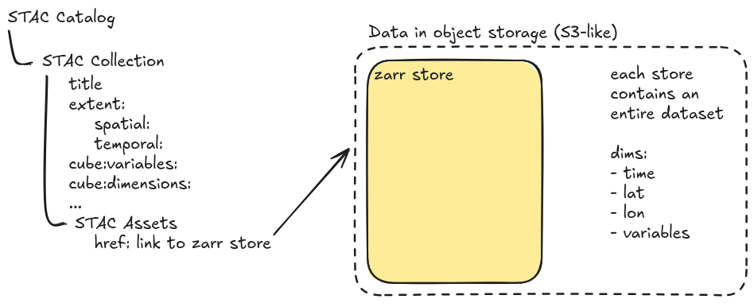
        <figcaption align = "center"> Example of STAC collection of unaligned satellite imagery with each STAC item pointing to a Zarr store. </figcaption>
    </figure>

### Industry Adoption and Future-Proofing

**ESA's Zarr Commitment**: The European Space Agency is incrementally [moving the Sentinel satellite archive to Zarr](https://zarr.eopf.copernicus.eu), signaling that "the future of planetary-scale data is chunked, cloud-optimized, and open."

**Emerging Standards**:
- **GeoZarr specification**: Standardizing geospatial metadata in Zarr
- **Zarr v3 with sharding**: Reducing file proliferation while maintaining performance
- **Icechunk integration**: Adding transactional consistency to Zarr workflows
- [OGC GeoDataCube Future Standard](https://www.ogc.org/announcement/ogc-forms-new-geodatacube-standards-working-group/)

**Why This Matters for Research**:
- **Future compatibility**: Align with emerging industry standards
- **Reduced vendor lock-in**: Open formats enable tool flexibility
- **Scalable workflows**: Start local, scale to cloud seamlessly
- **Collaborative research**: Shared standards enable data sharing

## DuckLake: SQL as Lakehouse Metadata

### Addressing Iceberg's Limitations

While Apache Iceberg pioneered open table formats, it has [practical limitations](https://quesma.com/blog-detail/apache-iceberg-practical-limitations-2025):

<figure>
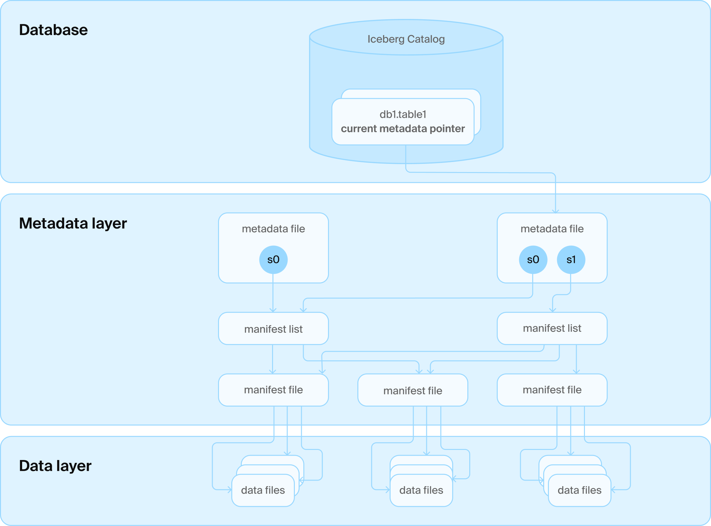
<figcaption align = "center"> Iceberg's metadata architecture requires many small files and HTTP requests for even simple queries. </figcaption>
</figure>

**Iceberg Challenges**:
- **Metadata complexity**: Many small files requiring multiple HTTP requests
- **Write amplification**: Single-row updates create multiple metadata files
- **Compaction overhead**: Requires separate Spark jobs for maintenance
- **Limited real-time capabilities**: Optimized for batch, not streaming

    <figure>
        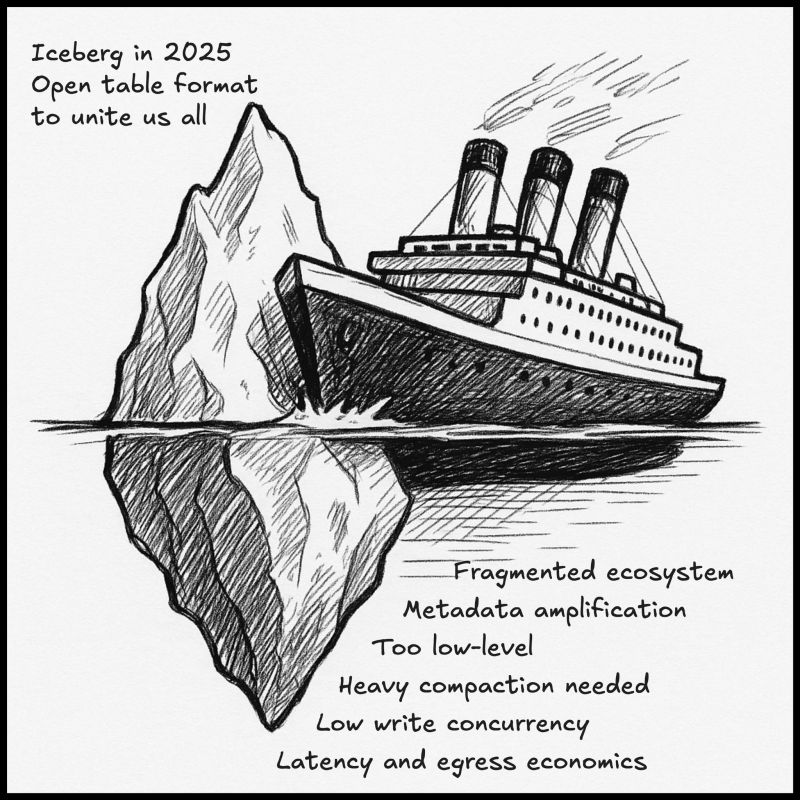
        <figcaption align = "center"> Sample of remaining issues in Iceberg despite gaining widespread adoption </figcaption>
    </figure> 

### DuckLake's SQL-First Approach

DuckLake addresses these limitations by storing metadata in a transactional SQL database rather than as "many small files" in object storage. This enables single-query metadata access, reliable ACID transactions, and seamless integration with existing SQL tools. You can learn more in their [concise manifesto](https://ducklake.select/manifesto/). 

**The Fundamental Problem with Existing Formats**:

Iceberg and Delta Lake were designed to avoid databases entirely, encoding all metadata into "a maze of JSON and Avro files" on blob storage. However, they hit a critical limitation: as soon as you need something as ambitious as a second table or versioning, you realize **finding the latest table version is tricky in blob stores** with inconsistent guarantees. The solution? Adding a catalog service backed by... a database.

**The Irony**: After going to great lengths to avoid databases, both formats ended up requiring one anyway for consistency. Yet they never revisited their core design to leverage this database effectively.

**DuckLake's Insight**:

> *"Once a database has entered the Lakehouse stack anyway, it makes an insane amount of sense to also use it for managing the rest of the table metadata! We can still take advantage of the 'endless' capacity and 'infinite' scalability of blob stores for storing the actual table data in open formats like Parquet, but we can much more efficiently and effectively manage the metadata needed to support changes in a database!"*

**Core Design Principles**:
1. **Store data files** in open formats on blob storage (scalability, no lock-in)
2. **Manage metadata** in a SQL database (efficiency, consistency, transactions)

<figure>
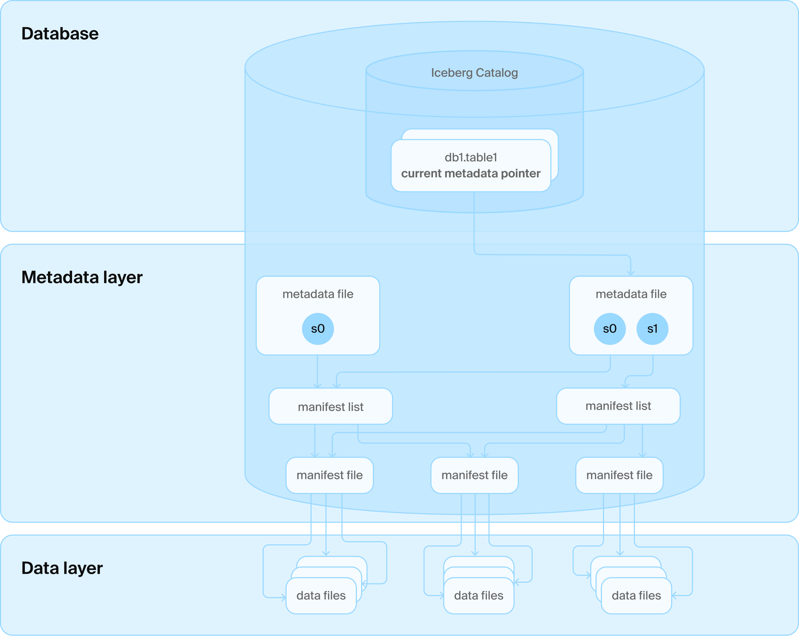
<figcaption align = "center"> DuckLake's architecture leverages a SQL database for metadata management and blob storage for data files. </figcaption>
</figure>

**Technical Advantages**:
- **Pure SQL transactions** describe all data operations (schema, CRUD)
- **Cross-table transactions** manage multiple tables atomically
- **Referential consistency** prevents metadata corruption (no duplicate snapshot IDs)
- **Advanced database features** like views, nested types, transactional schema changes
- **Single query access** vs. multiple HTTP requests to blob storage

## Simplifying Cloud Complexity: The Raw Architecture Advantage

Reference: [Why Coiled?](https://docs.coiled.io/user_guide/why.html)

### The Over-Engineering Problem

Most cloud setups today suffer from excessive layering and complexity:

> *"Today many platforms run frameworks on frameworks on frameworks... Every layer promises to hide abstractions, but delivers to you a new abstraction to learn instead."*

**Common Cloud Stack Complexity**:
- **Kubernetes** → **Docker** → **Container Registry** → **Service Mesh** → **Your Code**
- **Data Platform** → **Workflow Orchestrator** → **Cluster Manager** → **Your Analysis**

**Problems with Layered Abstractions**:
- **Leaky abstractions**: You still need to debug through all layers when things break
- **Weak abstractions**: Each layer restricts functionality without providing equivalent power
- **Learning overhead**: New abstractions to master instead of hidden complexity
- **Cost multiplication**: Each layer adds infrastructure and operational overhead

### The Raw Cloud Architecture Solution

For most small-medium research teams, cloud advantages can be simplified to **two fundamental primitives**:

#### 1. "Infinitely" Scaling Object Storage (S3-Compatible)

**What it provides**:
- **Unlimited capacity**: Store petabytes without infrastructure planning
- **Global accessibility**: Access data from anywhere with internet
- **Durability**: nearly fail-proof data durability
- **Cost efficiency**: tens of cents/GB/month for standard storage; even cheaper for infrequent access data

**Why it matters for EO research**:
- **Satellite archives**: Reference existing STAC imagery without local copies
- **Collaborative datasets**: Share large geospatial datasets across research teams
- **Backup and archival**: Secure long-term storage for research outputs
- **Version control**: Multiple dataset versions without local storage explosion

#### 2. Ephemeral, Highly Parallelized Compute (EC2-Style VMs)

**What it provides**:
- **Massive parallelism**: Spin up 100s of machines in minutes that can leverage reading chunked ND-arrays from distributed object storage
- **Diverse hardware**: CPUs, GPUs, high-memory, cheaper ARM processors on-demand
- **Geographic distribution**: Process data close to where it's stored
- **Pay-per-use**: $0.02/hour for powerful machines, shut down immediately after use

**Why it matters for EO research**:
- **Burst processing**: Handle large satellite imagery processing jobs quickly
- **Cost control**: Pay only for active computation time
- **Experimentation**: Try different hardware configurations without commitment
- **Scalability**: Process datasets that exceed local machine capabilities

This means we can simplify our fundamental cloud scaling architecture to object storage + compute VMs:

    <figure>
        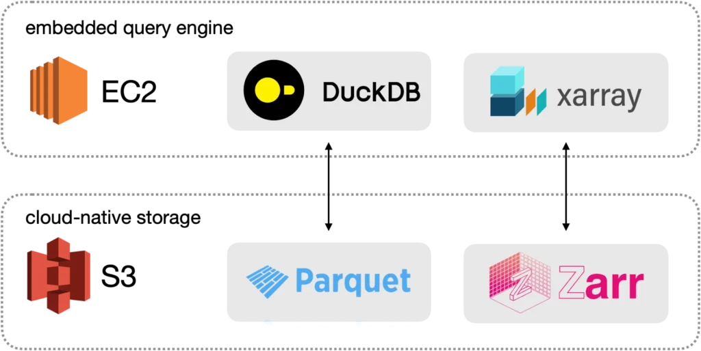
        <figcaption align = "center"> An instance of the raw cloud architecture for Ice-mELT pipelines. </figcaption>
    </figure>

### The "$0.47 Moment": Abundant Computing Psychology

**The Transformation**: When researchers discover they can process massive datasets for under a dollar:

> *"The greatest joy in our job is seeing someone access hundreds of machines to do an overnight job in a few minutes. The next greatest joy is when they find out that it cost them $0.47. At that moment there's a spark in their mind that says 'I can do this as often as I like. I can go way bigger.'"*

**Psychological Impact**:
- **Abundance mindset**: Resources feel unlimited rather than scarce
- **Creative thinking**: Opens possibilities instead of constraining them
- **Experimental freedom**: Try ambitious approaches without budget anxiety
- **Team scaling**: Entire research groups can adopt powerful workflows

### Practical Implementation for Research Teams

**Start Simple**:
- **Local development**: DuckDB + dbt for prototyping and small datasets
- **Cloud storage**: Cloudflare R2 free tier for sharing and backup
- **Burst compute**: Coiled/Dask for occasional large-scale processing

**Scale Gradually**:
- **MotherDuck**: Cloud DuckDB when local processing becomes insufficient
- **Neon PostgreSQL**: Managed metadata storage for collaborative workflows
- **Icechunk + Zarr**: Transactional array storage for production datasets

**Avoid Over-Engineering**:
- **No Kubernetes**: Unless you're running 18+ high-availability services
- **No complex orchestration**: Unless you have dedicated DevOps teams
- **No vendor lock-in**: Stick to open standards and portable formats

### The Research Lab Sweet Spot

**Perfect for**:
- **Small-medium teams** (2-20 researchers)
- **Iterative workflows** with changing requirements
- **Budget-conscious** academic or startup environments
- **Collaborative research** requiring data sharing
- **Experimental approaches** needing flexible infrastructure

**Key Benefits**:
- **Frictionless development**: Same tools locally and in cloud
- **Abundant cheap computing**: Process massive datasets for dollars
- **Infrastructure for everyone**: **No dedicated IT team or Cloud Engineer required**
- **Composable architecture**: Integrate with existing research tools

## Research Lab and SME Advantages

### Collaborative Research Benefits

**Multi-user Access**:
- **PostgreSQL metadata**: Reliable concurrent access for research teams
- **Shared data catalogs**: Common view of datasets across projects
- **Version control**: Track data lineage and experimental iterations

### Hybrid Deployment Flexibility

**Local Development**:
- **DuckDB**: Fast local analysis and prototyping
- **Local filesystem**: Immediate data access during development

**Cloud Scaling**:
- **MotherDuck**: Seamless scaling for larger computations
- **R2 object storage**: Cost-effective data sharing
- **Neon PostgreSQL**: Managed metadata without infrastructure overhead

### Cost-Conscious Innovation

**Research Economics**:
- **Start free**: Develop within free tier limits
- **Scale gradually**: Pay only when exceeding research-scale requirements
- **Avoid vendor lock-in**: Open formats enable tool flexibility

## Quality Over Quantity Philosophy

### Data Governance for Research

As highlighted in [ML4Devs analysis](https://www.ml4devs.com/en/articles/who-cares-if-big-data-is-dead/):

**Real Problems**:
- **Data quality** over data quantity
- **Data literacy** within organizations  
- **Clear motives** for data collection and analysis

**Research Best Practices**:
- **Curated datasets**: Focus on validated, high-quality sources
- **Clear provenance**: Track data lineage and processing steps
- **Purposeful collection**: Collect data to answer specific research questions

### Modern Tool Integration

**DataOps Principles**:
- **Version control**: Git-based workflows for data and code
- **Automated testing**: Data quality checks and pipeline validation
- **Collaborative development**: Shared environments and reproducible results

## Future-Proofing Strategy

### Technology Evolution Path

**Current State**: Local DuckDB + dbt development  
**Near-term**: MotherDuck + Neon cloud integration  
**Long-term**: Full lakehouse with Iceberg + STAC catalogs

### Avoiding Complexity Traps

**Lessons from Big Data Era**:
- **Start simple**: Use appropriate tools for actual data sizes
- **Avoid premature optimization**: Don't build for scale you don't have
- **Focus on value**: Prioritize insights over infrastructure complexity

**Modern Approach**:
- **Single-node first**: Leverage modern hardware capabilities
- **Cloud when needed**: Scale up only when local processing insufficient
- **Open standards**: Maintain flexibility and avoid vendor lock-in
